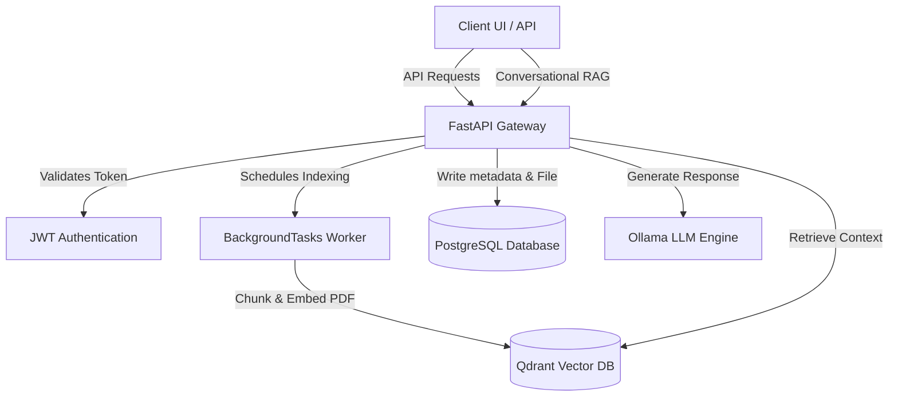

# Enterprise Knowledge Assistant

A secure, multi-tenant Enterprise Retrieval-Augmented Generation (RAG) platform that indexes corporate documents and enables intelligent conversational interactions.

---

## Project Overview

The Enterprise Knowledge Assistant is designed to solve the challenge of isolated corporate data access. It allows users within distinct business tenants to upload PDF documents, automatically parses and indexes them into vector and relational stores under strict multi-tenant isolation, and provides a semantic search and conversation layer using Ollama local LLMs.

---

## Key Features

- **Multi-Tenant Isolation:** Dynamic user authentication and JWT validation ensure tenants never cross-access documents or chat history.
- **Automatic Document Indexing:** Uploads are indexed immediately in the background using FastAPI `BackgroundTasks`, updating statuses from `PROCESSING` to `COMPLETED` or `FAILED` automatically.
- **Hybrid Search & Chat Service:** Combines Qdrant vector retrieval with historic metadata constraints to build contextual, hallucination-free prompts for Ollama.
- **Secure File Deletion:** Deletes document database records, local storage files, and vector indices in a transactional fallback sequence.
- **Clean Structure:** Production-ready project layout with separated backend, docs, and placeholder frontend layers.

---

## Architecture



---

## Tech Stack

- **Backend:** FastAPI (Python), SQLAlchemy, Alembic (future)
- **Vector Search:** Qdrant Client (for high-dimensional semantic search)
- **LLM Integration:** Ollama (local model inference, defaults to `phi3:mini`)
- **Package Manager:** `uv` (modern Python workflow manager)
- **Database:** PostgreSQL (production-ready relational data store)
- **Frontend (Planned):** React, CSS

---

## Repository Structure

```text
enterprise-rag/
├── backend/                  # FastAPI Backend Application
│   ├── app/                  # Main source code
│   │   ├── api/              # Route handlers & endpoints
│   │   ├── core/             # Application settings & configs
│   │   ├── models/           # SQLAlchemy models
│   │   ├── schemas/          # Pydantic validation schemas
│   │   └── services/         # Domain business logic (Qdrant, LLM, retrieval)
│   ├── tests/                # Automated pytest suite
│   ├── scripts/              # Utility diagnosis & verification scripts
│   ├── uploads/              # Local storage for uploaded PDF files (git-ignored)
│   ├── requirements.txt      # Dependency lock list
│   ├── pyproject.toml        # Backend package definition
│   ├── uv.lock               # UV lock file
│   ├── .env                  # Local secrets and config (git-ignored)
│   ├── .env.template         # Environment template file
│   ├── README.md             # Backend development instructions
│   └── main.py               # Application entry point
│
├── frontend/                 # React Frontend Application (planned)
│   └── .gitkeep              # Folder placeholder
│
├── docs/                     # Shared System Documentation
│   ├── architecture/         # Architectural notes and diagrams
│   ├── api/                  # API endpoints and swagger info
│   ├── screenshots/          # Application walkthrough visuals
│   └── diagrams/             # Flowcharts and database schemas
│
├── .gitignore                # Global git ignored directories
├── LICENSE                   # MIT License
├── Makefile                  # Local shortcuts for running backend commands
└── README.md                 # Project root documentation
```

---

## Screenshots

*(Screenshots of the conversational chat interface and document index lists will be added here)*

---

## Backend Setup

1. **Prerequisites:**
   Ensure Python 3.10+, PostgreSQL, Qdrant, and Ollama are installed and running locally.
2. **Installation:**
   Navigate to the backend directory and install dependencies:
   ```bash
   cd backend
   uv pip install -r requirements.txt
   ```
3. **Environment Setup:**
   Copy the environment template and populate it:
   ```bash
   cp .env.template .env
   # Update database connection strings, JWT secret, and Qdrant credentials
   ```
4. **Run Server:**
   You can run the server directly using:
   ```bash
   uv run uvicorn main:app --reload
   ```
   Or from the root directory using the Makefile:
   ```bash
   make backend
   ```

---

## Frontend Setup

*(The React frontend setup steps will be added in a future implementation phase)*

---

## API Overview

Key backend API routes exposed under `http://localhost:8000`:
- `POST /auth/register` - Tenant registration
- `POST /auth/login` - Retrieve access tokens
- `POST /documents/upload` - Secure document upload (returns HTTP 202)
- `GET /documents` - List documents for the authenticated tenant
- `DELETE /documents/{document_id}` - Clean resource deletion
- `POST /chat` - Semantic context conversational query

---

## Future Roadmap

- **Docker Support:** Containerize FastAPI, PostgreSQL, and Qdrant services.
- **CI/CD Integration:** Automated tests, lints, and builds on GitHub Actions.
- **Frontend Implementation:** Responsive React user interface.
- **Alembic Migrations:** Version-controlled database schema changes.

---

## License

This project is licensed under the MIT License. See the [LICENSE](LICENSE) file for details.
